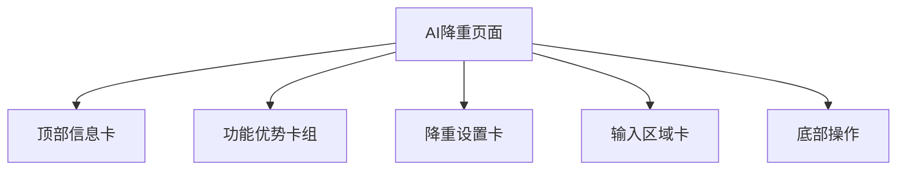

# 设计文档：AI降重页面



## 分层设计
- **视图层**：WXML 结构拆为顶部 info、feature 卡组、settings、input、footer。
- **状态层**：`Page.data` 新增设置项状态，沿用 `formData` 风格。
- **交互层**：事件处理函数负责更新 `data` 及调用 `updateExpectedCost()`。

## 模块与依赖
| 模块 | 描述 | 依赖 |
| --- | --- | --- |
| `HeaderCard` | 标题、副标题、积分展示 | 读取 `credits` |
| `FeatureGroup` | 三个固定feature卡 | 静态数据 |
| `SettingCard` | 学科领域、语言、模式、平台 | 选择器/开关组件 |
| `InputCard` | 文本输入、字数、费用 | 与 `updateExpectedCost`、`startRewrite` 交互 |
| `FooterActions` | 开始降重按钮+提示 | 依赖 `isRewriting`, `wordCount`, `expectedCost`, `credits` |
| `ResultSection` | 进度、结果 | 与原逻辑一致 |

## 接口契约
- 组件均使用原生标签；`picker` 供下拉选择。
- 事件：`bindchange`、`bindtap`、`bindinput`。
- 数据：
  ```js
  {
    disciplines: [...], disciplineIndex,
    languages: [...], languageIndex,
    platforms: [...], platformIndex,
    modeEnabled: true/false
  }
  ```

## 数据流向
- 用户操作设置项 → 对应 handler 更新 index + 文案 → 不影响成本计算（除文案）。
- 文本输入 → `wordCount` & `expectedCost` → 按钮状态、预计费用显示。
- `startRewrite` → 进度条 → `completeRewrite` → 结果卡片。

## 异常处理
- 字数不足/积分不足时 `wx.showToast` 提示；按钮禁用。
- 复制/保存失败使用现有提示逻辑。

## UI 细节
- 背景：浅蓝渐变。
- 卡片：白底、圆角 36rpx、阴影。
- 按钮：渐变 `#2563eb → #9333ea`，圆角 24rpx。

