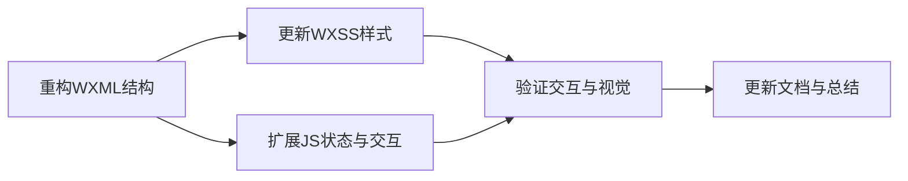

# 任务拆分：AI降重页面

## T1 重构 WXML 结构
- **输入**：现有 `index.wxml`、设计稿需求。
- **输出**：新的 WXML 结构，包含 info 卡片、feature 卡、设置卡、输入卡、结果卡、Tips。
- **约束**：使用原生标签；保持语义一致；确保滚动结构正确。
- **依赖**：无前置。

## T2 更新 WXSS 样式
- **输入**：T1 输出的结构。
- **输出**：与设计匹配的 CSS 类定义。
- **约束**：rpx 单位；无 `@media`；避免复合选择器。
- **依赖**：T1。

## T3 扩展 JS 状态与交互
- **输入**：现有 `index.js`。
- **输出**：新增设置项数据、事件、文案更新。
- **约束**：不破坏原有降重逻辑；保持兼容性。
- **依赖**：T1，T2（了解结构与类名）。

## T4 验证交互与视觉
- **输入**：T1-T3。
- **输出**：验证说明；修复发现问题。
- **约束**：在微信开发者工具检查。
- **依赖**：T1-T3。

## T5 更新文档
- **输入**：最终实现。
- **输出**：接受记录、总结与 TODO。
- **约束**：符合项目文档规范。
- **依赖**：T4。

