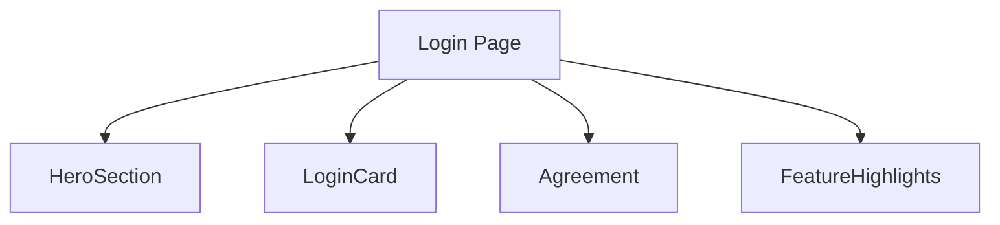

# 设计文档：登录页面

## 模块说明
- **HeroSection**：顶部渐变背景 + logo + 标语。
- **LoginCard**：玻璃拟态卡片（手机号输入、验证码输入+按钮、登录按钮、快速登录）。
- **Agreement**：协议提示文本。
- **FeatureHighlights**：功能亮点卡片网格。

## 布局
- 页面使用 `flex` 垂直布局 + `scroll-view`。
- 背景添加两层渐变圆形装饰。
- 登录卡片宽度 100%，内部使用 `flex`/`grid` 调整输入与按钮。

## 样式要点
- 背景渐变：`linear-gradient(180deg, #131c4d → #3f2b96 → #a8c0ff)`。
- 卡片：半透明背景 `rgba(255,255,255,0.75)`，`backdrop-filter: blur(20rpx)`，圆角 40rpx。
- 主按钮：蓝紫渐变，阴影 `rgba(64,63,191,0.3)`。
- 验证码按钮禁用态：浅灰渐变、文字半透明。
- 功能亮点卡：轻度阴影、圆角 28rpx，图标背景渐变。

## 交互
- 表单逻辑沿用现有 JS。
- 验证码按钮倒计时阶段文案 `{{countdown}}s`，禁用样式。
- 快速登录按钮使用幽灵样式。

## 异常处理
- 输入错误提示继续通过 `wx.showToast`。
- 若后续接入后端，再扩展错误展示。

