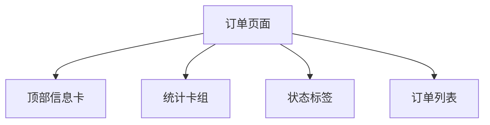

# 设计文档：订单页面



## 模块说明
- **HeaderCard**：显示标题、副标题、充值按钮。
- **SummaryCard**：四个统计模块，展示总数等。
- **Tabs**：全部、已完成、进行中、失败。
- **OrderList**：遍历订单数据生成卡片。

## 数据结构
```js
orders: [
  { id, title, subtitle, credits, amount, status, finishedAt }
]
```

- `status` 枚举：`completed`, `processing`, `failed`。
- 统计从 orders 计算。

## 交互
- Tabs `bindtap` 更新 `activeTab`，调用过滤函数。
- 充值按钮跳转个人中心或充值页面。

## UI 细节
- 背景：浅色渐变。
- 卡片：白底、圆角 36rpx、阴影。
- 按钮：绿色/蓝色标签，金额红色，积分绿色。

## 异常处理
- 没有订单时展示空状态提示。

