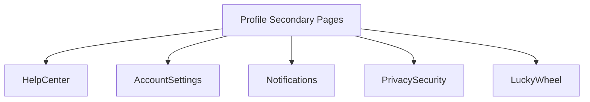

# 设计文档：个人中心二级页面

## 帮助中心 (HelpCenter)
- **Hero卡片**：标题、副文案、快速联系卡。
- **搜索栏**：`input` + icon。
- **标签筛选**：`tags` 列表，点击切换 active。
- **FAQ 列表**：折叠卡片，显示分类标签，支持展开详细内容。
- 数据：`faqList` 数组，每项含 `id`、`title`、`category`、`content`。
- 过滤逻辑：根据关键词、当前选中分类实时过滤。

## 账号设置 (AccountSettings)
- **用户信息卡**：头像、昵称、手机号、修改按钮（toast）。
- **偏好设置**：多个 `switch` 控制（深色模式、自动保存、邮件订阅）。
- **安全提醒**：操作按钮（修改密码、绑定邮箱）。

## 消息通知 (Notifications)
- **提醒开关卡**：总开关 + 推送渠道开关。
- **消息列表**：卡片式显示最近通知（标题、副标题、时间、类型标签、未读红点）。
- **数据**：`notifications` 每条含 `id`、`category`、`title`、`desc`、`time`、`unread`。
- **交互**：
  - 点击消息或“标记已读”按钮更新 `unread=false`。
  - 读取后刷新个人中心入口红点（通过全局储存或事件）。

## 隐私安全 (PrivacySecurity)
- **安全状态卡**：显示账号安全评级。
- **权限设置**：多个开关（访问历史、位置、语音等）。
- **数据操作**：按钮组（下载数据、删除记录、联系客服）。

## 幸运转盘 (LuckyWheel)
- **结构**：
  - 顶部说明卡：标题、副标题换行。
  - 转盘区域：简化为 6 个奖励格子，可用布局模拟；中心抽奖按钮。
  - 奖励列表：展示最近抽奖记录。
- **交互**：点击抽奖按钮 → 随机选择奖励 → 展示结果弹窗/卡片 → 写入通知列表。
- **奖励示例**：积分 +20、积分 +50、额外降重次数、VIP 体验日、再接再厉等。

## 视觉风格
- 背景：延续浅蓝渐变 (#eef4ff → #ffffff)。
- 卡片：白底 + 阴影、圆角 32~40rpx。
- 标题：主标题与副标题分行，间距 6-8rpx。
- 按钮：蓝紫渐变主按钮、灰色描边次按钮。
- 标签：胶囊样式，选中时蓝底白字。

## 交互要点
- 标签切换 `activeCategory`，搜索输入 `searchKeyword`。
- FAQ 展开 `openFaqId`。
- 开关使用 `switch` 控件，更新本地 state。
- 按钮点击 `wx.showToast` 模拟后续功能。

