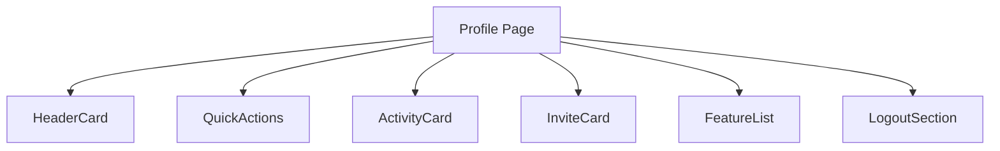

# 设计文档：个人中心



## 模块拆解
- **HeaderCard**：显示头像、昵称、VIP、注册时间、积分及三项统计。
- **QuickActions**：三列卡片按钮（余额、邀请好友、幸运转盘）。
- **ActivityCard**：活动模块，含说明与“幸运转盘”按钮。
- **InviteCard**：邀请好友模块，显示邀请码、统计与邀请按钮。
- **FeatureList**：其他功能列表（账号设置、消息通知、隐私安全、帮助中心）。
- **LogoutSection**：退出按钮。

## 数据结构
```js
userInfo: {
  nickname,
  avatar,
  vipLevel,
  vipBadge,
  registerDate,
  credits
},
stats: { balance, totalOrders, generatedDocs, invitedCount, gainedCredits },
inviteCode: "LUNJUN2024"
```

## 样式要点
- 背景：顶部渐变(#4158D0→#C850C0)过渡，底部浅色渐变。
- 卡片圆角：32rpx~48rpx，阴影柔和。
- Buttons：渐变橙色/红色等，文本16px-18px，图标圆形背景。
- 列表：白色卡片+分隔线，右侧箭头。

## 交互
- 卡片按钮 `bindtap` 调用既有 `handleMenuClick`。
- 邀请按钮 `bindtap` 触发 `handleInvite`（可重用 `handleMenuClick`）。
- 复制邀请码按钮 `bindtap` 调用 `copyInviteCode`。

## 异常处理
- 若缺少数据用默认值显示；保持页面稳定。

